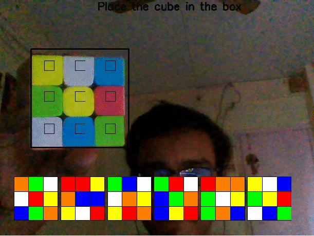
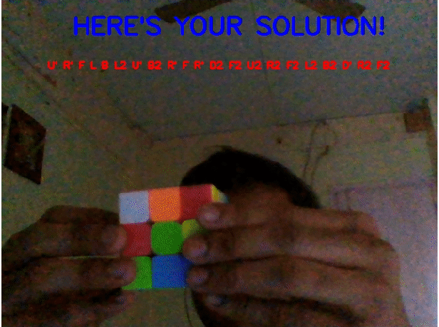

<!-- PROJECT LOGO -->
<p align="center">
  <a href="https://github.com/ssreeramj/rubik-cube-solver">
    
  </a>

  <h3 align="center">Rubik's Cube Solver</h3>

  <p align="center">
    This is a simple OpenCV project where the program identifies the colors of each face of the cube and gives the solution to solve the cube
    <br>
    <br>
  </p>
</p>


<!-- TABLE OF CONTENTS -->
<details open="open">
  <summary><h2 style="display: inline-block">Table of Contents</h2></summary>
  <ol>
    <li>
      <a href="#about-the-project">About The Project</a>
      <ul>
        <li><a href="#built-with">Built With</a></li>
      </ul>
    </li>
    <li>
      <a href="#getting-started">Getting Started</a>
      <ul>
        <li><a href="#prerequisites">Prerequisites</a></li>
        <li><a href="#installation">Installation</a></li>
      </ul>
    </li>
    <li><a href="#usage">Usage</a></li>
    <li><a href="#roadmap">Roadmap</a></li>
    <li><a href="#contributing">Contributing</a></li>
    <li><a href="#contact">Contact</a></li>
  </ol>
</details>


<!-- ABOUT THE PROJECT -->
## About The Project
<p align="center">
  
   
</p>


### Built With

* [OpenCV](https://opencv.org/)
* [Kociemba](https://pypi.org/project/kociemba/)


<!-- GETTING STARTED -->
## Getting Started

To get a local copy up and running follow these simple steps.

### Prerequisites

You need to have Python installed in your system, any version above 3.6 will be fine.

### Installation

1. Clone the repo
   ```sh
   git clone https://github.com/ssreeramj/rubik-cube-solver.git
   ```
2. Install required packages
   ```sh
   pip install -r requirements.txt
   ```
3. Run the program
   ```sh
   python main.py
   ```

<!-- USAGE EXAMPLES -->
## Usage

This current version of the program is not much flexible and works for the following colors: Red, Blue, Orange, Green, White, Yellow.

Start displaying the cube in the following order with *WHITE* color on top: *RED -> BLUE -> ORANGE -> GREEN*

After this, display *WHITE* and *YELLOW* centers keeping the *BLUE* center on your left.

Press *SPACE* to capture a particular face and press *n* to capture the face again.

<!-- ROADMAP -->
## Roadmap

1. Make the application more flexible such as capability to identify different colors.
2. Be able to identify the cube, without the hardcoded box.

Feel free to suggest any improvements in the *ISSUES* section.


<!-- CONTRIBUTING -->
## Contributing

Contributions are what make the open source community such an amazing place to be learn, inspire, and create. Any contributions you make are **greatly appreciated**.

1. Fork the Project
2. Create your Feature Branch (`git checkout -b feature/AmazingFeature`)
3. Commit your Changes (`git commit -m 'Add some AmazingFeature'`)
4. Push to the Branch (`git push origin feature/AmazingFeature`)
5. Open a Pull Request


<!-- CONTACT -->
## Contact

<a href="mailto:ssreeramj@gmail.com"> 
